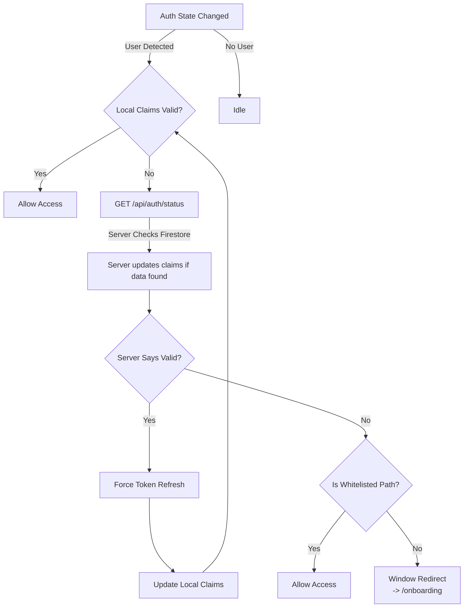

# AuthManager Component Specification

## Overview

`AuthManager` is a client-side Svelte component responsible for enforcing authentication policies and ensures the user's session is in a valid state. It runs in the background of the application layout, acting as a "policy enforcer" for user lifecycle states.

**Location**: `src/components/svelte/AuthManager.svelte`

## 1. Core Responsibilities

1.  **Lifecycle Enforcement**: Ensures authenticated users have completed all required onboarding steps.
2.  **Session Repair (Self-Healing)**: Detects and fixes discrepancies between the client's cached token and the authoritative server state.
3.  **Legacy Account Migration**: Triggers server-side logic to backfill missing custom claims for older accounts.

## 2. Policy Definitions

The application defines a "valid" authenticated user as one who possesses specific **Custom Claims** on their Firebase ID Token.

| Claim | Required Value | Meaning |
| :--- | :--- | :--- |
| `eula_accepted` | `true` | User has agreed to the End User License Agreement. |
| `account_created` | `true` | User has created a profile (nick, avatar) and an account document. |

If a user is authenticated (`auth.currentUser !== null`) but lacks either of these claims, they are considered "Incomplete" and must be redirected to the onboarding flow.

## 3. Logic Flow & Implementation Details

The component initializes `onMount` (client-side only) and sets up a listener for `auth.onAuthStateChanged`.

### 3.1. The Check Routine
When a user is detected, the component executes the following check:

1.  **Extract Claims**: Gets `eula_accepted` and `account_created` from the current ID token.
2.  **Verify Status**:
    -   **Pass**: Both claims are `true`. Do nothing.
    -   **Fail**: One or both claims are missing/`false`. Proceed to **Step 3.2 (Repair)**.

### 3.2. The Repair Strategy (Oracle Pattern)
If the local token seems invalid, the component queries the server to see if the token is merely "stale" or if the user is truly incomplete.

1.  **Query Oracle**: `GET /api/auth/status` (Credentials included).
    *   *Server Logic*: The server verifies the session cookie, checks Firestore for existing Account/Profile documents, and **updates the user's custom claims** on the backend if the data exists (Self-Healing/Migration).
    *   *Response*: `{ loggedIn: true, eula_accepted: boolean, account_created: boolean, uid: string }`
2.  **Compare**:
    *   If Server says `true` BUT Token says `false`: **Stale Token Detected**.
3.  **Force Refresh**:
    *   Calls `user.getIdToken(true)` to fetch a fresh token from Firebase (which will now contain the claims updated by the server in Step 1).
    *   Updates local state with the new values.

### 3.3. Enforcement (Redirect)
After the repair attempt, if the claims are *still* missing:

1.  **Check Whitelist**: Is the current path safe?
    *   `Allowed`: `/onboarding`
    *   `Allowed`: `/login*` (Any path starting with /login)
2.  **Action**:
    *   If path is **not allowed**, redirect window to `/onboarding`.
    *   Log debug message: "Redirecting from {path} to /onboarding due to {reason}".

## 4. Visual Logic Flow

## 5. Dependencies and Data Sources

### ID Token vs. Server State
*   **Primary Truth**: Firebase ID Token (Client-side cache).
*   **Oracle Truth**: `/api/auth/status` (Server-side verification + Firestore lookup).

### External Dependencies
*   `@firebase/client`: The `auth` instance.
*   `src/utils/logHelpers`: For `logDebug`.

## 6. Integration Points

*   **Mount Points**: The component is explicitly included in the following layouts:
    *   `src/layouts/Page.astro`
    *   `src/layouts/PageWithTray.astro`
*   **Server Endpoint**: `src/pages/api/auth/status.ts`.

## 7. Technical Debt & Future Improvements

### DRY Violation in Layouts
**Issue**: The `<AuthManager />` component is manually imported and mounted in multiple layout files (`Page.astro`, `PageWithTray.astro`), leading to code duplication and potential inconsistency.

**Proposed Remediation**:
*   Move the `<AuthManager client:only="svelte" />` declaration into `src/components/server/BaseTail.astro`.
*   **Impact**:
    1.  Eliminates manual inclusion in `Page.astro` and `PageWithTray.astro`.
    2.  Implicitly adds protection to `ModalPage.astro` (which uses `BaseTail`). This is considered a *feature*, as it provides a safety net for authenticated modal views.
    3.  `EditorPage.astro` remains unaffected (as it does not use `BaseTail`), maintaining its "no client-side auth" policy.

## 8. Relationship with Session Store

**Architecture Pattern**: Fail-Safe Decoupling.

The `AuthManager` deliberately maintains its own listener to `auth.onAuthStateChanged` instead of consuming the `sessionStore`.

### Why "Double" Listeners?
This redundancy is a security and stability choice, strictly prioritizing **Safety over DRY**:

1.  **Isolation of Concerns**:
    *   `AuthManager` is the **Gatekeeper**. Its only job is to banish invalid users to `/onboarding`.
    *   `SessionStore` is the **Data Provider**. Its job is to fetch profiles, sync subscriptions, and manage UI state.
2.  **Fault Tolerance**:
    *   If `SessionStore` crashes (e.g., Firestore error, profile parsing bug) or stalls, the `AuthManager` **must still function**.
    *   By listening directly to the raw SDK events, the policy enforcement cannot be broken by downstream data errors in the store.
3.  **Performance (Latency)**:
    *   `AuthManager` needs to redirect *immediately* upon auth detection. It should not wait for the `SessionStore` to finish reacting, changing states, or fetching dependencies.
