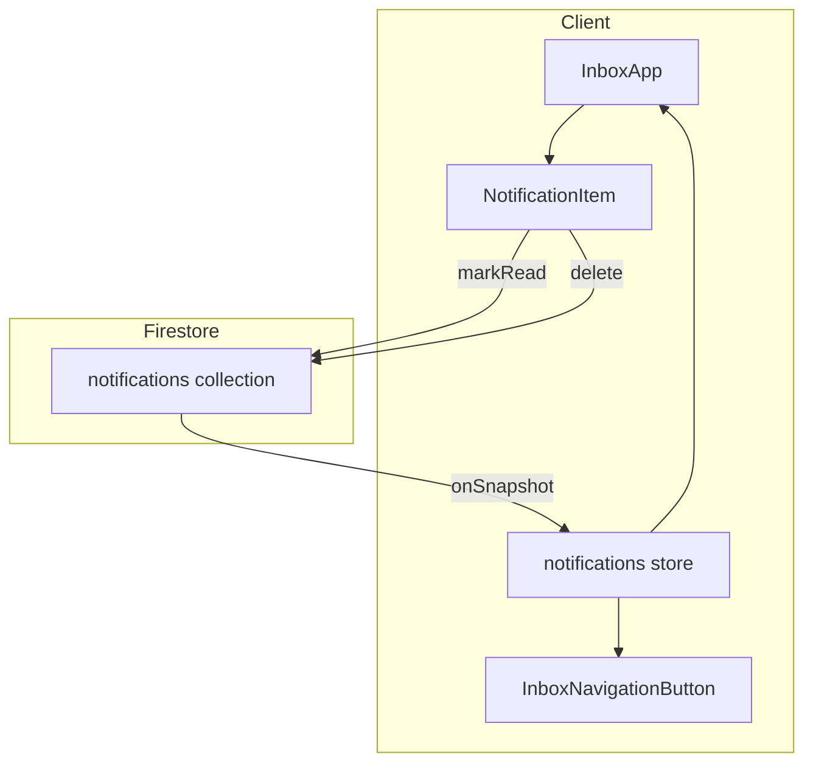

# Feature: Inbox

> **Status:** Draft (Spec for Triage)
> **Layer:** CSR Only

## Blueprint

### Context

The inbox is the user-facing interface for viewing, managing, and acting on notifications. It provides a centralized place to see what's happened since the user's last visit.

**Core Problem:** Inbox UX is reported as low quality due to missing functionality.

### Architecture



#### Key Files

| File | Purpose |
|------|---------|
| `src/stores/inbox/index.ts` | Nanostore with Firestore subscription |
| `src/components/svelte/inbox/InboxApp.svelte` | Main inbox page component |
| `src/components/svelte/inbox/InboxNavigationButton.svelte` | Nav badge with unread count |
| `src/components/svelte/inbox/NotificationItem.svelte` | Single notification line item |
| `src/firebase/client/inbox/markRead.ts` | Mark single notification read |
| `src/firebase/client/inbox/deleteNotification.ts` | Delete single notification |
| `src/pages/inbox/index.astro` | Astro page wrapper |

#### Store Behavior

- **Reactivity:** The store listens to `$uid` changes (from session) to automatically finding proper user context.
    - `onMount`: Subscribes to `$uid`. If `uid` exists, calls `subscribeToNotifications(uid)`.
    - `uid` change: If `uid` clears (logout), calls `unsubscribe()`.
- **Query:** `where('to', '==', uid)`, `orderBy('createdAt', 'desc')`, `limit(10)`
- **Persistence:** Uses `@nanostores/persistent` for offline cache
- **Computed:** `newCount` = count of notifications where `read === false`
- **Error Handling:** Explicitly suppresses `permission-denied` errors during `onSnapshot` to handle race conditions during logout (where the listener might try to fire one last time before the `unsubscribe` completes).

### Current UX

| Feature | Status |
|---------|--------|
| View notifications | ✅ Works |
| Mark individual as read | ✅ Works |
| Delete individual | ✅ Works |
| Click to navigate | ✅ Works (with `?jumpTo=unread`) |
| Badge shows unread count | ✅ Works |

### Known Gaps / Issues

> [!CAUTION]
> Missing functionality that degrades UX

| Gap | Impact |
|-----|--------|
| **No "Mark All Read"** | Users must click each notification individually |
| **No empty state** | Shows nothing when no notifications (no friendly message) |
| **Hard limit of 10** | Can't see older notifications, no pagination |
| **No load more / pagination** | History is lost after 10 notifications |
| **No notification grouping** | 5 replies = 5 separate items (visual clutter) |
| **No auto-mark-read on click** | Clicking link doesn't mark as read |
| **Timestamp display** | Shows raw ISO date (e.g., `2025-12-30`), not relative ("2 hours ago") |

### Confirmed Bugs

> [!CAUTION]
> These bugs have been traced to specific code locations.

#### Bug 1: Notification timestamps not using relative time

**Symptom:** Timestamps show `2025-12-30` instead of "5 days ago".

**Root Cause:**
- [NotificationItem.svelte line 61](file:///Users/ville.takanen/dev/pelilauta-17/src/components/svelte/inbox/NotificationItem.svelte#L61) calls `toDisplayString(notification.createdAt)` without `relative = true`
- Compare with [ReplyArticle.svelte line 34](file:///Users/ville.takanen/dev/pelilauta-17/src/components/svelte/discussion/ReplyArticle.svelte#L34) which correctly uses `toDisplayString(reply.updatedAt, true)` on mount

**Fix:** Pass `true` as second argument:
```svelte
{toDisplayString(notification.createdAt, true)}
```

#### Bug 2: Hardcoded 'fi' locale in toDisplayString

**Symptom:** Relative times always display in Finnish regardless of user preference.

**Root Cause:**
- [contentHelpers.ts line 4](file:///Users/ville.takanen/dev/pelilauta-17/src/utils/contentHelpers.ts#L4) has default `locale = 'fi'`
- No caller passes the user's preferred locale

**Future Fix:** Wire up i18n locale detection (deferred - requires broader i18n work).

### Anti-Patterns

- **No Empty State**: Empty inbox shows nothing instead of "No notifications" message.
- **Silent Truncation**: Oldest notifications silently disappear when count exceeds 10.
- **Manual Two-Step**: User must click link, then click check icon to mark read.

---

## Contract

### Definition of Done

- [ ] Spec committed to `plans/inbox/spec.md`
- [ ] Critical gaps prioritized for implementation
- [ ] Inbox provides minimum viable UX for notification management

### Scenarios

**Scenario: View Inbox**
- Given a logged-in user with notifications
- When user navigates to `/inbox`
- Then user sees their notifications sorted newest-first

**Scenario: Mark as Read**
- Given a notification with `read: false`
- When user clicks the check icon
- Then notification is updated to `read: true`
- And the badge count decreases by 1

**Scenario: Navigate from Notification**
- Given a `thread.reply` notification
- When user clicks the target link
- Then user navigates to `/threads/{key}?jumpTo=unread#discussion`
- ⚠️ Current: Notification is NOT auto-marked as read

**Scenario: Empty Inbox**
- Given a user with no notifications
- When user navigates to `/inbox`
- Then user sees "No notifications" message
- ⚠️ Current: Shows empty container with "0 notifications" count

**Scenario: Mark All Read**
- Given multiple unread notifications
- When user clicks "Mark All Read"
- Then all notifications updated to `read: true`
- And badge shows 0
- ⚠️ Current: No "Mark All Read" button exists

### UI Components

```
┌─────────────────────────────────────────────────────┐
│ Inbox                                               │
│ Your notifications                                  │
├─────────────────────────────────────────────────────┤
│ ┌─────────────────────────────────────────────────┐ │
│ │ 💬 [ProfileLink] replied to your thread         │ │
│ │    [Thread Title Link]                          │ │
│ │    2 hours ago · thread.reply            [✓][🗑]│ │
│ └─────────────────────────────────────────────────┘ │
│ ┌─────────────────────────────────────────────────┐ │
│ │ ❤️ [ProfileLink] loved your thread              │ │
│ │    [Thread Title Link]                          │ │
│ │    5 hours ago · thread.loved            [✓][🗑]│ │
│ └─────────────────────────────────────────────────┘ │
├─────────────────────────────────────────────────────┤
│                                    [ Mark All Read ]│
│                                    2 new notifications│
└─────────────────────────────────────────────────────┘
```

### Verification

Manual testing:
1. Log in as any user
2. Navigate to `/inbox`
3. Verify notifications display correctly
4. Test mark-read and delete actions
5. Confirm navigation links work
