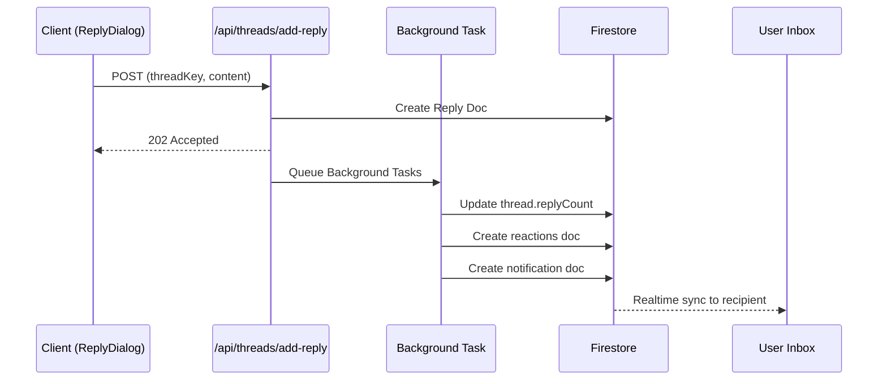

# Feature: Notification System

> **Status:** Draft (Spec for Triage)
> **Layer:** Server-Side (API)

## Blueprint

### Context

The notification system generates and delivers in-app notifications to users when relevant events occur (replies, loves, invites). Notifications are *active* signals (distinct from passive "Content Tracking" / unread indicators).

**Core Problem:** Reply notifications may not be generated correctly, causing users to miss replies to their threads.

### Architecture



#### Notification Types

| Type | Trigger | Recipients |
|------|---------|------------|
| `thread.reply` | New reply to a thread | Thread owner (first owner) |
| `thread.loved` | Thread receives love | Thread owner |
| `reply.loved` | Reply receives love | Reply owner |
| `site.invited` | User invited to site | Invited user |
| `site.loved` | Site receives love | Site owner |
| `page.loved` | Page receives love | Page owner |
| `handout.update` | Handout created/updated | Handout recipients |

#### Data Models

- **Schema:** `src/schemas/NotificationSchema.ts`
  - `NotificationSchema`: Client-facing model with `Date` types
  - `NotificationRequestSchema`: API request payload
- **Collection:** `notifications` (Firestore root collection)

#### Creation Paths

**Path 1: Server API (Primary - used for replies)**
- Entry point: `src/pages/api/threads/add-reply.ts`
- Background function: `executeBackgroundTasks()` (lines 73-159)
- Creates notification directly in Firestore (no API call)

**Path 2: Client via Send API (Legacy/Backup)**
- Entry point: `src/firebase/client/threads/addReply.ts`
- Calls `POST /api/notifications/send`
- API handler: `src/pages/api/notifications/send.ts`

#### Key Files

| File | Purpose |
|------|---------|
| `src/pages/api/threads/add-reply.ts` | Server-side reply + notification creation |
| `src/pages/api/notifications/send.ts` | Generic notification send API |
| `src/firebase/client/threads/submitReply.ts` | Client calls add-reply API |
| `src/firebase/client/threads/addReply.ts` | Client-side reply (legacy path) |
| `src/schemas/NotificationSchema.ts` | Zod schemas, collection name |

### Known Gaps / Issues

> [!WARNING]
> These are suspected issues to investigate, not confirmed bugs.

1. **Single Recipient Only**: Both paths only notify `thread.owners[0]` — reply subscribers (reaction.subscribers) are not notified.
2. **Background Task Reliability**: `executeBackgroundTasks()` uses `setTimeout(..., 0)` which may not execute reliably in serverless environments.
3. **No Deduplication Window**: Same key overwrites previous notification, but rapid replies could cause race conditions.
4. **Self-notification Skip**: Logic at line 114 skips if `thread.owners[0] === author`, but doesn't handle multi-owner scenarios.

### Confirmed Bugs

> [!CAUTION]
> These bugs have been traced to specific code locations.

#### Bug 1: `reply.loved` notifications show raw key instead of title

**Symptom:** When a reply is loved, the notification shows `2AMjDOutbn0A38ZXMdsx` instead of a human-readable title.

**Root Cause:**
- [ReplyArticle.svelte line 49](file:///Users/ville.takanen/dev/pelilauta-17/src/components/svelte/discussion/ReplyArticle.svelte#L49) does not pass `title` prop to `ReactionButton`
- [reactions API line 158](file:///Users/ville.takanen/dev/pelilauta-17/src/pages/api/reactions/index.ts#L158) falls back: `targetTitle: title || targetKey`
- Since `title` is undefined, it uses the raw `targetKey`

**Fix:** Pass a title prop to `ReactionButton` in `ReplyArticle.svelte`, e.g.:
```svelte
<ReactionButton target="reply" small key={reply.key} title={reply.markdownContent?.substring(0, 50)} />
```

### Anti-Patterns

- **Fire-and-Forget Logging Only**: Notification failures are logged but not surfaced to users or retried.
- **Inconsistent Paths**: Two creation paths (`addReply.ts` client-side vs `add-reply.ts` API) with slightly different logic.

---

## Contract

### Definition of Done

- [ ] Spec committed to `plans/notification-system/spec.md`
- [ ] Reply notification flow verified working
- [ ] Known gaps addressed (subscriber notifications, background reliability)

### Scenarios

**Scenario: Reply Notification Created**
- Given a thread owned by User A
- When User B posts a reply
- Then a `thread.reply` notification is created for User A
- And the notification appears in User A's inbox

**Scenario: Self-Reply No Notification**
- Given a thread owned by User A
- When User A posts a reply to their own thread
- Then NO notification is created

**Scenario: Notification Key Uniqueness**
- Given User B already replied to User A's thread
- When User B posts another reply
- Then a NEW notification is created (key includes targetKey)
- ⚠️ Current behavior: Overwrites previous notification (same key)

### Verification

Manual testing:
1. Open two browser sessions (User A, User B)
2. User A creates a thread
3. User B replies to the thread
4. User A should see notification in inbox
